# Q & A

## Table of Contents

- [Q & A](#q--a)
  - [DNS & SSL/TLS](#dns--ssltls)
    - [TLS Handshake Process](#tls-handshake-process)
  - [Load Balancers](#load-balancers)
  - [Cloud Domain/DNS](#cloud-domaindns)
- [Jira Ticket](#jira-ticket)
  - [Section 1 - www.jira.com/GCP-1234](#section-1---wwwjiraccomgcp-1234)
  - [Troubleshooting Process](#troubleshooting-process)
  - [Root Cause](#root-cause)

## DNS & SSL/TLS

* Both traceroute and dig are command line networking troubleshooting tools.  While the dig command assists with checking if a domain resolves to the desired IP address, traceroute presents the path(hops) that packets travel to reach the desired destination.  Traceroute pinpoints where possible error may occur on their trip.  Dig is useful for viewing DNS records in detail.

**Source:** https://blog.crowncloud.net/post/how-to-test-network-connectivity-in-linux-ping-traceroute-dig-nslookup/.

| | |
|---|---|
| 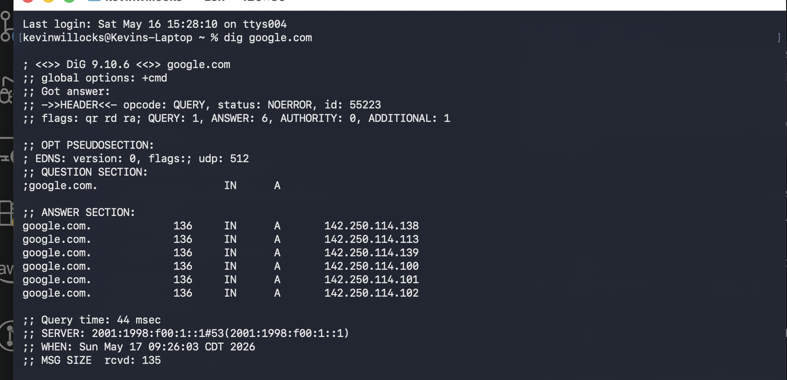 | 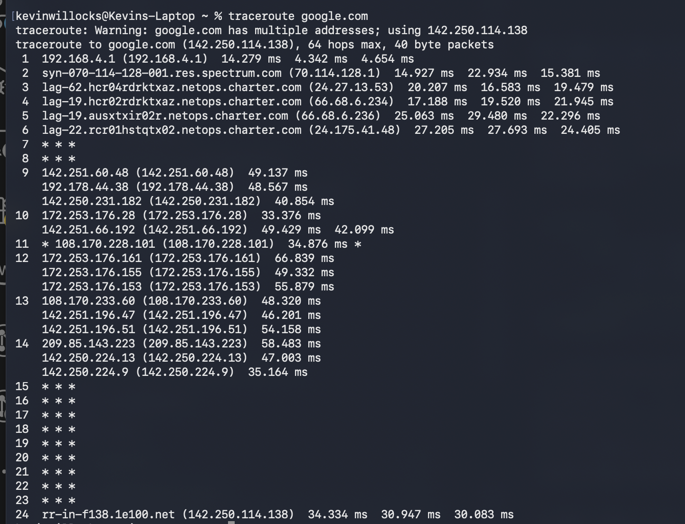 |
| *Example of Dig command output.* | *Example of Traceroute command output.* |

* The most common DNS record types are A, AAAA, MX, and CNAME.

| Record        | Use Case |
| ------------- |-------------|
| A             | Resolves DNS name to its IPv4 address|
| AAAA          | Resolves DNS name to its IPv6 address|
| MX            | Used by email applications to identify authorized email servers|
| CNAME         | Used to point a domain to another domain's name|

**Source:** https://keetmalin.medium.com/common-dns-record-types-explained-fe0a83d20115 & https://youtu.be/HnUDtycXSNE?si=cFBhSM0kctJ2FNDX

### TLS Handshake Process

1. Client's browser sends what is known as a "Hello" message to the desired server.  The message will contain the TLS version the client's browser is using.
2. The server replies to the client's message with its own "Hello" message.  This message contains the server's SSL certificate.
3. The client will verify the legitimacy of the SSL certificate by checking it with the entity (certificate authority) that issued it.
4. Once the legitimacy is confirmed, the client sends what is known as a premaster secret.  It is encrypted by a public key that only the private key held by the server can decrypt.
5. The server will decrypt the premaster secret
6. After the secret is decrypted, the client and server create sessions keys
7. The client and server will send an encrypted "finished" message

**Source:** https://www.cloudflare.com/learning/ssl/what-happens-in-a-tls-handshake/

* The Certificate authority sells SSL/TLS certificates to businesses and individuals.  Prior to issuing the certificate, the CA checks the domain and owner details to ensure authenticity.  When a client accesses a website, the website presents its certificate which causes the browser to validate its authenticity.

**Source:** https://aws.amazon.com/what-is/ssl-certificate/

## Load Balancers

* The HTTPS Proxy is the service that offloads SSL.  This is done through the SSL/TLS handshake process.

**Source:** https://docs.cloud.google.com/load-balancing/docs/target-proxies
https://www.huntress.com/cybersecurity-101/topic/ssl-offloading

* A good use case for backend in-flight encryption would be a credit card processor aligning with PCI DSS Requirement 4, which focuses on protecting cardholder data with strong cryptography over open, public networks. While it may not be required for every environment, enabling it makes the audit conversation easier.

**Source:** https://www.middlebury.edu/sites/default/files/2025-01/PCI-DSS-v4_0_1.pdf?fv=AKHVQBp6
https://docs.cloud.google.com/load-balancing/docs/ssl-certificates/encryption-to-the-backends

## Cloud Domain/DNS

* Multiple domains can point to the same LB.  An example is amazon.com and aws.amazon.com.  Zones can be thought of as boxes that contain a DNS record(s).  The two types of zones are public and private.  A DNS in a public zone exposes it to the internet.  On the other hand, a private zone a DNS is exposed only to the VPC it belongs in.

**Source:** https://docs.cloud.google.com/dns/docs/dns-overview#private_zone

# Jira Ticket

### Section 1 - www.jira.com/GCP-1234

* **Title** - VM Instance cannot connect to the internet
* **Description** - VM could not be accessed from external clients.
* **Expected behavior** VM should be able to be accessed from external clients
* **Current behaviors**:
  1. VM is marked as Stopped
  2. Application is unreachable
  3. SSH is disabled

  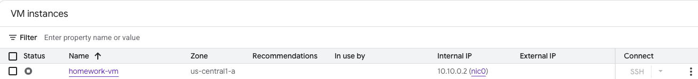

### Troubleshooting Process

1. Open the VM Details Page and noticed the instance is marked as "Stopped"
2. Checked subnet details
3. Checked Firewall rules and noticed the Deny All rule had a Priority of 0

   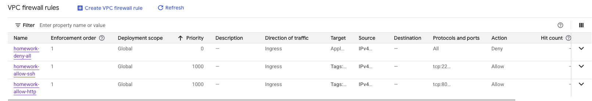

   * Changed the Deny All rule's Priority to 1200
     * Restarted VM and ensured it was in the "running" status
   * Checked SSH access and was presented with the Received Connection via Cloud Identity-Aware Proxy Failed error

     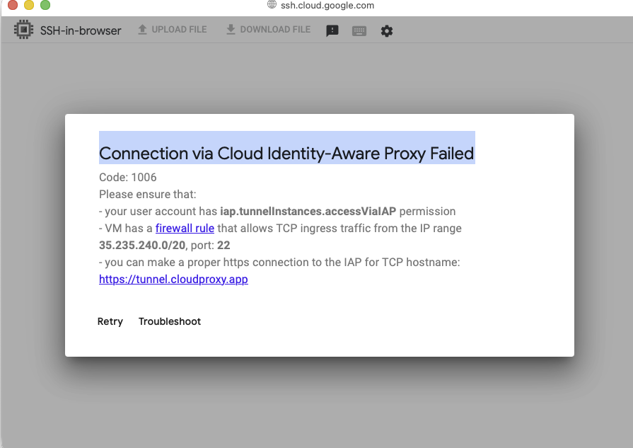

     * Compared SSH Firewall rules and noticed the source range does not match the range the error suggested

       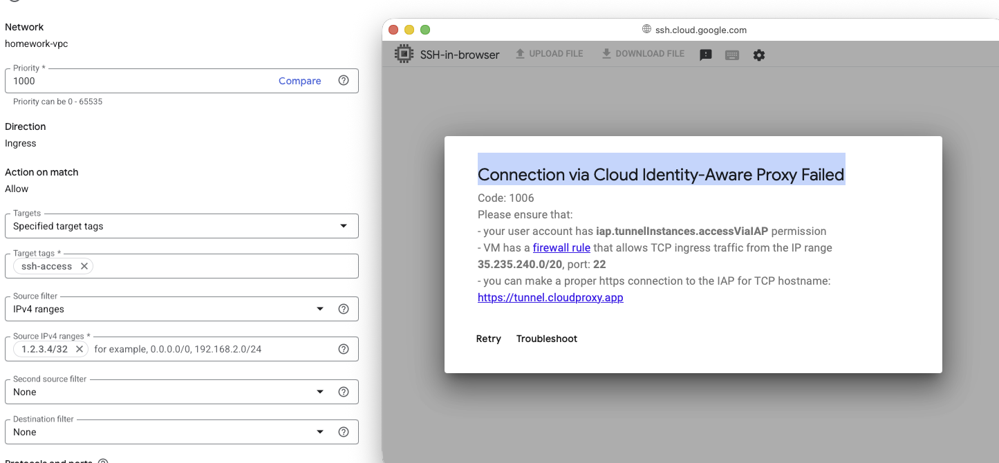

       * Changed IPv4 source range to what range the error mentioned

       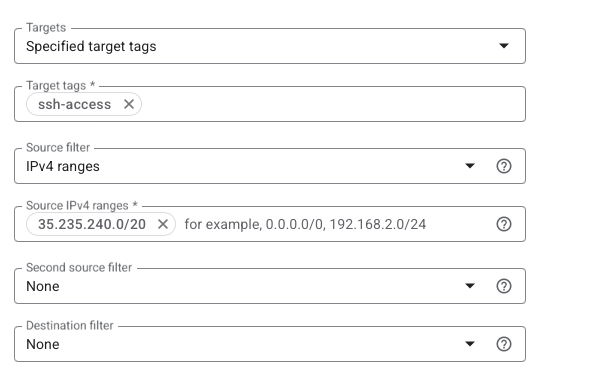

4. Opened SSH window for the instance and pinged Google. Although packets were transmitted, 0 were received by the client

   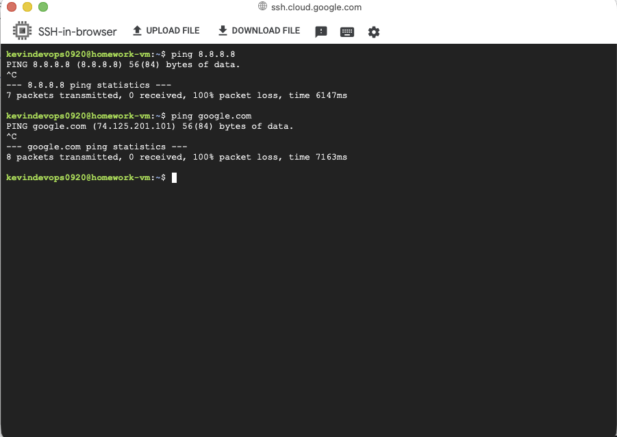

5. Opened VM details and saw that the firewalls were not checked

   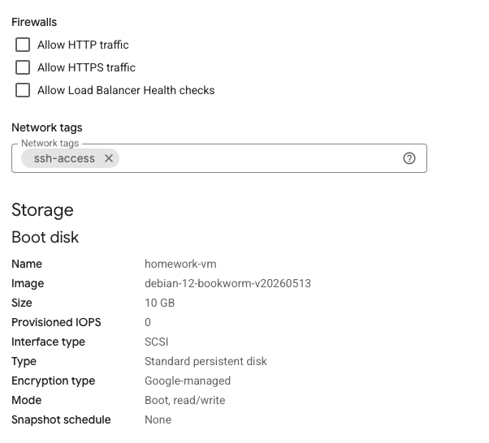

   * Selected Allow HTTP Traffic and saved changes

6. Checked details of the VM's startup script
   * Opened the Network Interfaces for the VM and noticed that external IPv4 address was set to "None". As a result, changed the external address to "Ephemeral"

7. Attempted to access VM through client browser
8. Navigated back to VM's Network Interface details and noticed the lack of a route to the internet gateway

   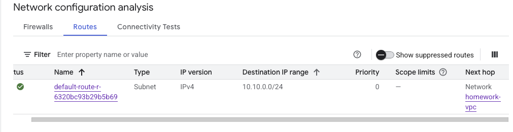

9. Opened the Routes page and clicked on Route Management to create a route and associate it to the VM's VPC

   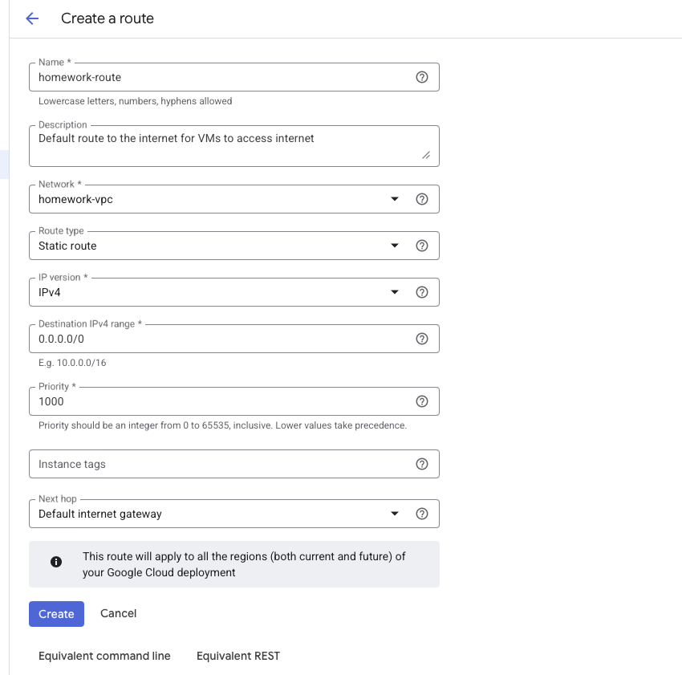

10. Returned to the VM's Network Interface details to ensure the route was successfully created

    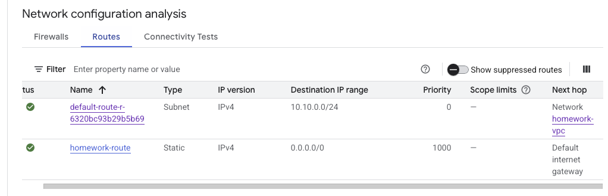

11. Re-opened the SSH browser and pinged Google.com
12. Accessed the VM via a web browser

### Root Cause

* VM did not have an external IP address.  In addition, VM did not have a route to the public internet.